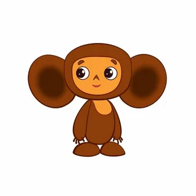

# Портфолио типового ученика Нетологии

+ Рост - ниже среднего
+ Вес - по верхней планке
+ Глаза - широкие, округленные от объема поступающей визуальной информации
+ Уши - большие, обеспечивающие использование принципа локации для улавливания контекстной информации
+ Ногти - нестриженные, ибо некогда

[Подробная информация об обучающей организации](http://netology.ru)
  

